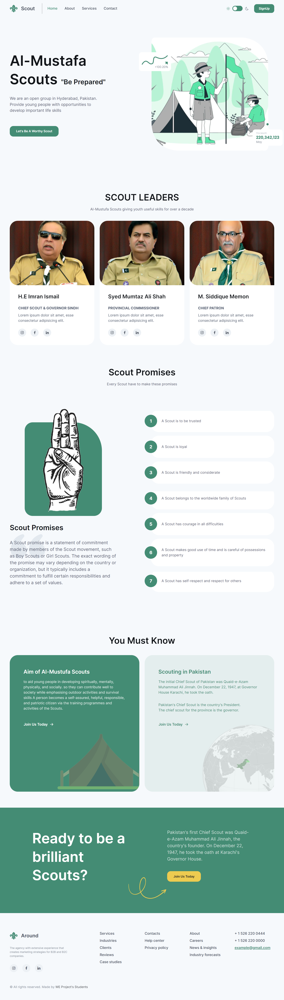
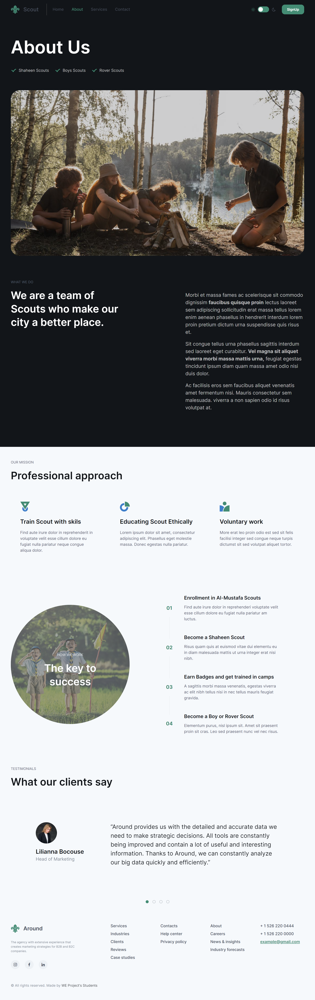
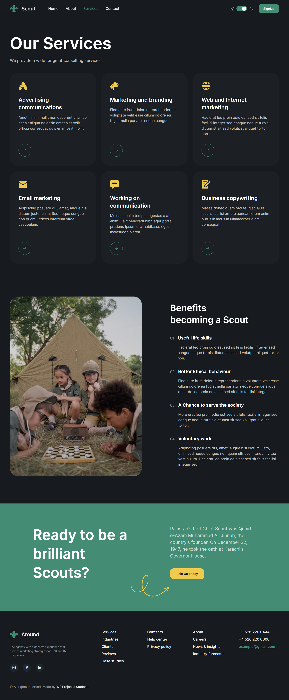
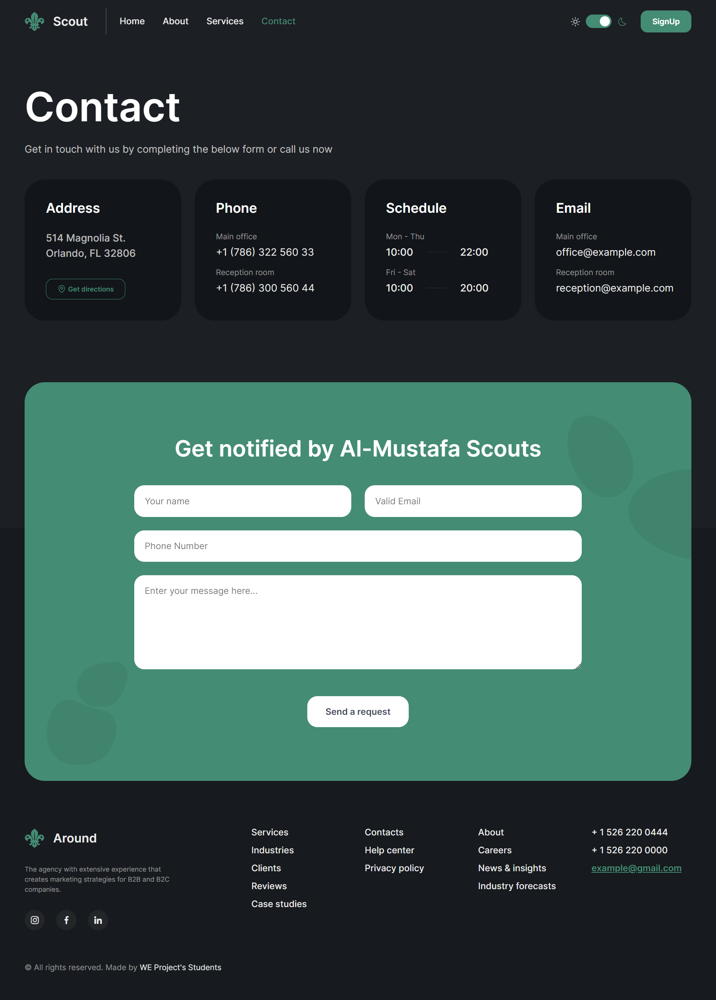
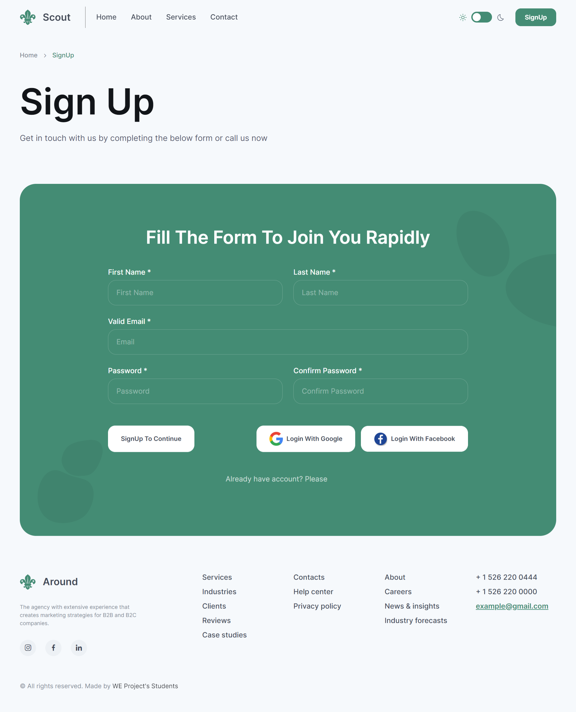

<h1> Al MUSTUFA SCOUT Website </h1>
<h1> Introduction </h1>

This website is a platform that introduces and showcases the services and contributions of scouts in society. Additionally, it allows individuals to register and become a scout. The website consists of four pages, including a sign-up form for registration. 

<ul> 
<li> Pages </li> 
<li> Home </li>
<li> About </li>
<li> Services </li>
<li> Contact </li>
</ul>

<h1> Purpose </h1>
The purpose of this website is to promote the concept of scouting and to encourage people to join as scouts. It highlights the importance of scouts in society and the role they play in securing individuals and society in uncertain and dangerous scenarios.

<h1> Functionality </h1>
The website allows users to register as a scout after signing up. The user's credentials are stored in a MongoDB database on the cloud. The contact page allows users to submit queries, which are received as an email using the nodemailer package.

<h1>UX</h1>
The website has a simple and appealing design, focusing on providing the best user experience for accessing information. The use of contrasting colors, fonts, and images makes the website visually attractive.

<h1>Technology Used</h1>
The website has been built using the following technologies:

<ul> 
<li> HTML </li> 
<li> CSS </li>
<li>JavaScript </li>
<li> Node.js </li>
<li> Express </li>
<li> MongoDB </li>
</ul>

<h1>Packages Used</h1>
The following packages have been used in this project:
<ul>

<li>"@types/passport-google-oauth20": "^2.0.11"
<li>"cookie-parser": "^1.4.6" </li>
<li>"debug": "^4.3.4" </li>
<li>"dotenv": "^16.0.3" </li>
<li>"ejs": "^3.1.8" </li>
<li>"express": "^4.18.2" </li>
<li>"express-session": "^1.17.3" </li>
<li>"http-errors": "^2.0.0" </li>
<li>"mongoose": "^6.8.3" </li>
<li>"morgan": "^1.10.0" </li>
<li>"nodemailer": "^6.9.0" </li>
<li>"passport": "^0.6.0" </li>
<li>"passport-facebook": "^3.0.0" </li>
<li>"passport-google-oauth20": "^2.0.0" </li>
</ul>
<h1>How to Contribute </h1>
If you wish to contribute to this project, please feel free to fork the repository and submit a pull request with your changes.
